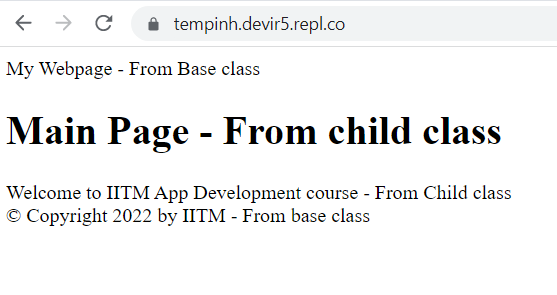

# Inheritance 
- The most important part of Jinja is template inheritance. 
- Template inheritance permits you to build a base template that contains all the common items of your wish.
- Next you can define blocks named child templates that can override the base template. 
. 
## The following programs specify how it executes:
- create main.py and create a folder templates. 
- Within templates folder create base.html (base class) and index.html(derived class).

## python code for inheritance
- File: main.py
```python linenums="1"
from flask import Flask, render_template
import random

app = Flask("app")

@app.route("/")
def home():
	# Generate the home page
  return render_template("index.html")
  
app.run(host = "0.0.0.0", port = "8080")

```
- File: base.html
```HTML linenums="1"
<!doctype html>
<html>
  <head>
    
    
    <title>Hello </title> My Webpage - From Base class
    
  </head>
  <body>
      
      
      
      &copy; Copyright 2022 by IITM - From base class
      
    
  </body>
</html>

```
- File: index.html
```HTML linenums="1"
<!DOCTYPE html>
<html>
    <head>
        <title>Home Page</title>
				
    </head>
    <body>
      
      
      
      
			<h1>Main Page - From child class</h1>
      <div>
      Welcome to IITM App Development course - From Child class
      </div>
      
      
			
    </body>
</html>
```
## Output



## Reference
https://jinja.palletsprojects.com/en/2.10.x/templates/